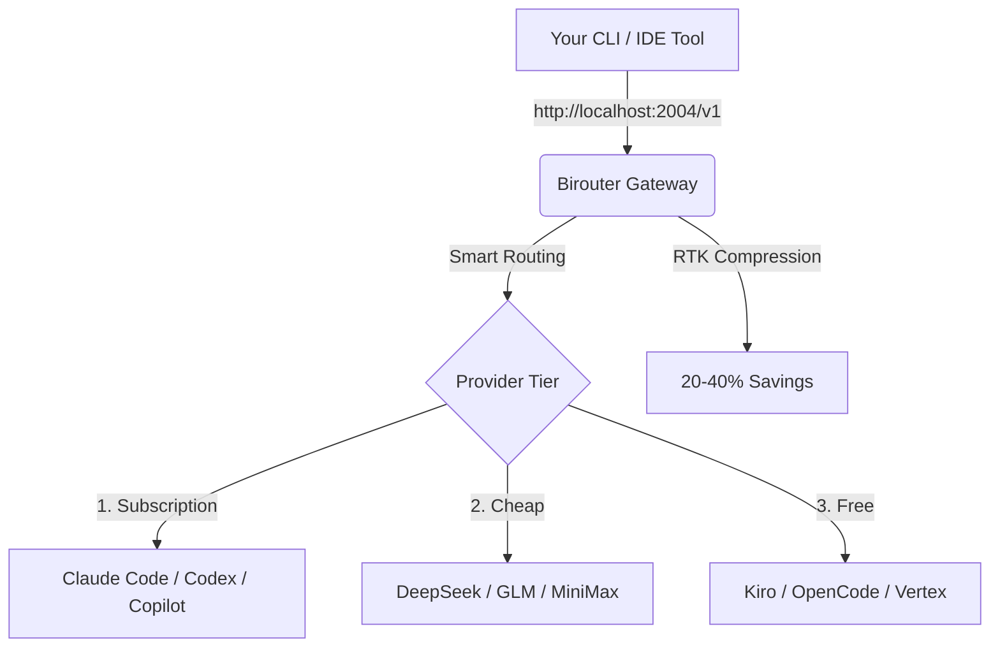

<div align="center">

# 🚀 Birouter — AI Router & Token Saver

**One endpoint for all your AI providers. Smart routing, auto-fallback, and 20-40% token savings.**

*Satu endpoint untuk semua penyedia AI. Routing cerdas, fallback otomatis, dan hemat token 20-40%.*

[](LICENSE)
[](https://www.npmjs.com/package/birouter)
[](#-bahasa-indonesia)

[🚀 Quick Start](#-quick-start) • [💡 Features](#-features) • [📖 Setup](#-setup) • [🤝 Contributing](docs/CONTRIBUTING.md) • [💝 Support](#-support)

</div>

---

## 🤔 Why Birouter? / Mengapa Birouter?

Birouter is a smart local gateway that sits between your AI tools (Claude Code, Cursor, Cline, Aider...) and 40+ AI providers. It helps you **maximize subscriptions** and **minimize costs**.

*Birouter adalah gateway lokal cerdas yang menjembatani alat AI Anda dan 40+ penyedia AI. Membantu Anda **memaksimalkan langganan** dan **meminimalkan biaya**.*

- 💰 **RTK Token Saver** — Auto-compress tool outputs (git diff, ls, grep), saving **20-40%** tokens.
- 🔄 **Auto Fallback** — Smooth transition: **Subscription → Cheap → Free**. Never hit a rate limit again.
- 🌍 **Universal Format** — Seamlessly translate between OpenAI, Claude, Gemini, and Vertex.
- 📊 **Savings Tracker** — Real-time analytics on how much money and tokens you've saved.

---

## 🔄 How It Works / Cara Kerja



---

## ⚡ Quick Start / Mulai Cepat

### English
**1. Install & Run:**
```bash
npm install -g birouter
birouter
```
**2. Connect:** Dashboard opens at `http://localhost:2004`. Connect your providers and copy your API key.
**3. Use:** Set your tool's endpoint to `http://localhost:2004/v1`.

### Bahasa Indonesia
**1. Instal & Jalankan:**
```bash
npm install -g birouter
birouter
```
**2. Hubungkan:** Dashboard terbuka di `http://localhost:2004`. Hubungkan penyedia AI Anda dan salin API key.
**3. Gunakan:** Atur endpoint alat AI Anda ke `http://localhost:2004/v1`.

---

## 💡 Key Features / Fitur Unggulan

| Feature / Fitur | Description / Deskripsi |
|:--- |:--- |
| 🚀 **RTK Token Saver** | Compresses tool outputs to save massive input tokens. / Kompres output tool untuk hemat token. |
| 🪨 **Caveman Mode** | Forces terse LLM replies to save output tokens. / Paksa jawaban singkat untuk hemat token output. |
| 🎯 **Smart Fallback** | Automatic routing across multiple tiers. / Routing otomatis antar tingkatan penyedia. |
| 👥 **Multi-Account** | Round-robin between multiple accounts per provider. / Bergilir antar banyak akun per penyedia. |
| 🔄 **Format Translation** | OpenAI ↔ Claude ↔ Gemini ↔ Vertex ↔ Kiro. |
| 🔍 **Fetch Models** | Discover available models with one click. / Temukan model yang tersedia dengan satu klik. |
| 📊 **Analytics** | Track tokens, cost, and total savings. / Lacak penggunaan token, biaya, dan total hemat. |
| 💾 **Cloud Sync** | Sync configuration across all your devices. / Sinkronisasi konfigurasi antar perangkat. |

---

## 🇮🇩 Dokumentasi Bahasa Indonesia

Kami menyediakan panduan lengkap dalam Bahasa Indonesia untuk memudahkan Anda:

- [🏠 Halaman Utama Dokumentasi](gitbook/content/id/index.md)
- [⚡ Panduan Mulai Cepat](gitbook/content/id/getting-started/quick-start.md)
- [🛠️ Panduan Pengembangan](docs/DEVELOPER.md)

---

## 📖 Setup & Configuration

### Environment Variables
Copy `.env.example` to `.env` and adjust the following:
- `PORT`: Default is `2004`.
- `DATA_DIR`: Where Birouter stores your config and logs.
- `JWT_SECRET`: Used for dashboard authentication.

### API Key Format
Birouter keys use the prefix `bi-` for easy identification:
`bi-{machineId}-{keyId}-{crc8}`

---

## 🌐 Supported Providers (40+)

Birouter supports almost every major AI provider, including:
- **Direct OAuth:** Claude Code, GitHub Copilot, Cursor, xAI, Gemini.
- **API Keys:** OpenAI, Anthropic, DeepSeek, Groq, Mistral, OpenRouter, Together, Fireworks.
- **Special Free Tiers:** Kiro AI, OpenCode Free, Vertex AI.

---

## 🤝 Contributing

We welcome contributions! Please see our [Contributing Guide](docs/CONTRIBUTING.md) and [Developer Guide](docs/DEVELOPER.md) to get started.

---

## 💝 Support / Dukungan

If Birouter helps you save money, consider supporting the development:
*Jika Birouter membantu Anda berhemat, pertimbangkan untuk mendukung pengembangan:*

<div align="center">

[](https://saweria.co/iqkat)

</div>

---

<div align="center">
  <sub>Built with ❤️ by <a href="https://github.com/IQ-Kat">Ikbal (IQ-Kat)</a>. Based on 9Router.</sub>
</div>
